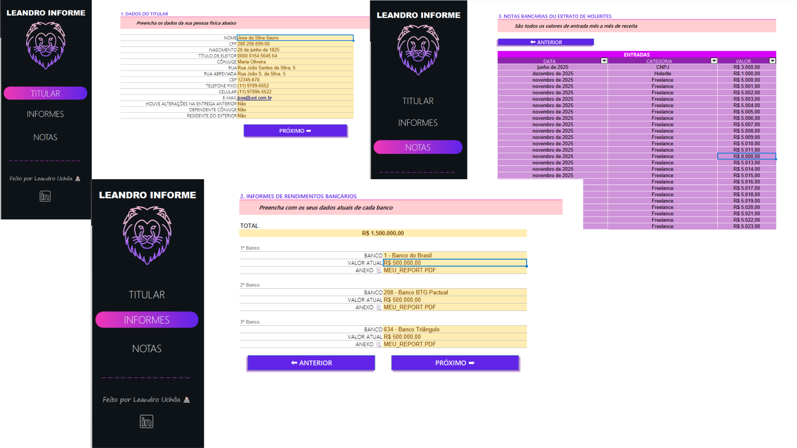

# Solução de Organização para o Imposto de Renda

  
  

> Ferramenta em planilha para coletar, organizar e validar informações essenciais para a declaração do Imposto de Renda.  
> Desenvolvido no LibreOffice Calc (versão 24.2) com foco na compatibilidade com Excel – sem o uso de VBA, tudo através de fórmulas, validações e formatações nativas.

---

---

## Sumário

- [Funcionalidades](#funcionalidades)
- [Requisitos](#requisitos)
- [Estrutura da Planilha](#estrutura-da-planilha)
- [Como Usar](#como-usar)
- [Download](#download)
- [Acessibilidade](#acessibilidade)
- [Contribuições](#contribuições)
- [Licença](#licença)

---

## Funcionalidades

- **Validação de Dados:**  
  - **CEP:** Garante o formato `00000-000`.  
  - **Telefone Fixo:** Entrada de 10 dígitos com formatação automática para `(00) 0000-0000`.  
  - **E-mail:** Validação que verifica a existência de apenas um "@" e um "." após o símbolo, prevenindo erros comuns.

- **Entrada Facilitada:**  
  O usuário insere somente os dígitos essenciais, enquanto as máscaras de formatação exibem os dados padronizados e orientam o preenchimento correto.

- **Interface Intuitiva:**  
  Menus de navegação e mensagens de entrada/erro amigáveis que guiam o usuário durante a inserção dos dados, aproximando a experiência de um sistema.

- **Lógica sem VBA:**  
  Toda a funcionalidade é implementada por meio de células nomeadas, fórmulas e validações do Calc, facilitando a manutenção e aumentando a portabilidade entre LibreOffice Calc e Excel.

---

## Requisitos

- **LibreOffice Calc:** Versão 24.2  
- **Microsoft Excel 365/2021:** Com suporte a fórmulas de matriz e funções avançadas  
- O projeto foi desenvolvido no LibreOffice Calc, garantindo total compatibilidade com o Excel.

---

## Estrutura da Planilha

A planilha é composta por três abas, proporcionando uma interface semelhante a um sistema:

- **TITULAR:** Informações e dados do titular.
- **INFORMES:** Coleta e organização dos informes necessários para a declaração.
- **NOTAS:** Seção destinada às notas e informações complementares.

Cada aba foi projetada para facilitar a navegação e a entrada dos dados, contribuindo para uma experiência de uso intuitiva.

---

## Como Usar

1. **Preenchimento dos Dados:**  
   - Insira os dados requisitados (por exemplo, CEP, telefone, e-mail e demais informações para o IR) nos campos apropriados de cada aba.
   - Siga as orientações das mensagens de entrada para garantir a formatação correta dos números e textos.

2. **Validações Automáticas:**  
   - Caso algum dado não esteja conforme o padrão (ex.: telefone com menos de 10 dígitos ou e-mail sem o caractere "@"), a planilha exibirá mensagens de erro para correção imediata.

3. **Navegação e Ajustes:**  
   - Utilize os menus e links rápidos disponíveis para navegar entre as abas **TITULAR**, **INFORMES** e **NOTAS** e consultar orientações adicionais.

---

## Download

Baixe a planilha em:  
[desafio_dio_excel_informe-app_ver-final_junho-25.xlsx](desafio_dio_excel_informe-app_ver-final_junho-25.xlsx)

As capturas de tela ilustrativas podem ser encontradas na pasta **Image**:  
- `print_leandro-informe (1).png`  
- `print_leandro-informe (2).png`  
- `print_leandro-informe (3).png`

---

## Acessibilidade

- Cores e contrastes testados para melhor visibilidade, utilizando ferramentas como o [WebAIM Contrast Checker](https://webaim.org/resources/contrastchecker/).  
- Textos alternativos foram adicionados a gráficos e imagens, visando a compatibilidade com leitores de tela.

---

## Contribuições

Pull requests e sugestões são bem-vindos!  
Antes de grandes alterações, por favor, abra uma issue para discutirmos as mudanças.

---

## Licença

Este projeto está licenciado sob a **MIT License**. Veja o arquivo [LICENSE](./LICENSE) para mais detalhes.
